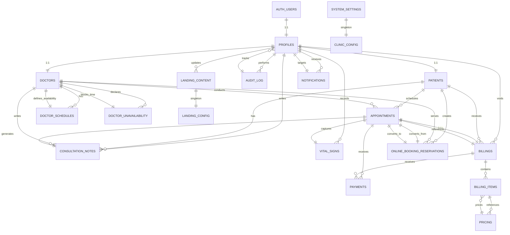

# CHIARA Clinic Management System - Comprehensive Documentation

**Version:** 1.0  
**Last Updated:** May 10, 2026  
**Framework:** Next.js 16.2.3 + TypeScript  
**Backend:** Supabase (PostgreSQL)  
**Deployment:** Vercel

---

## Table of Contents

1. [System Overview](#system-overview)
2. [Architecture](#architecture)
3. [Database Schema & ERD](#database-schema--erd)
4. [Core Entities](#core-entities)
5. [Key Features](#key-features)
6. [API Endpoints](#api-endpoints)
7. [User Roles & Permissions](#user-roles--permissions)
8. [Data Flow](#data-flow)
9. [Business Logic](#business-logic)

---

## System Overview

**CHIARA Clinic Management System** is a comprehensive healthcare management platform designed for **Dr. Chiara C. Punzalan, M.D.** The system manages:

- **Patient Management**: Registration, medical history, family history, vital signs
- **Appointment Scheduling**: Clinic visits and online consultations with intelligent slot allocation
- **Billing & Payments**: POS-integrated billing, multiple payment methods (Cash, GCash, QR, Card, Bank Transfer)
- **Consultation Management**: Medical notes, prescriptions, vital signs tracking
- **Doctor Scheduling**: Schedule management, unavailability periods, consultation fees
- **Reporting**: Revenue analytics, patient volume, peak hours, no-show rates
- **Landing Page**: Public-facing CMS with customizable content
- **Notifications**: Email and SMS alerts for appointments and system events

### Key Metrics

- **Max Patients per Hour:** 5 (configurable)
- **Consultation Fees:** ₱350 (default) - configurable per doctor per mode
- **Appointment Types:** Clinic (in-person) | Online (video consultation)
- **Queue System:** Up to 5 patients per time slot

---

## Architecture

### Tech Stack

| Layer | Technology |
|-------|-----------|
| **Frontend** | Next.js 16, React 19, Tailwind CSS 4, TypeScript 5 |
| **Backend** | Next.js API Routes, Supabase SDK |
| **Database** | PostgreSQL (Supabase) |
| **Authentication** | Supabase Auth (JWT-based) |
| **Payment Gateway** | PayMongo (online bookings) |
| **Notifications** | Email: EmailJS, SMS: TwilioJS |
| **Deployment** | Vercel |
| **Charts/Analytics** | Recharts |

### Project Structure

```
clinicmanagement-system/
├── app/                           # Next.js app directory
│   ├── (dashboard)/              # Protected dashboard routes
│   │   ├── appointments/          # Appointment management
│   │   ├── consultations/         # Consultation history
│   │   ├── patients/              # Patient management
│   │   ├── payments/              # Payment & billing
│   │   ├── reports/               # Analytics
│   │   ├── schedules/             # Doctor schedules
│   │   ├── settings/              # System settings
│   │   └── users/                 # User management
│   ├── api/                       # Backend API routes
│   │   ├── v2/                   # RESTful API v2
│   │   │   ├── appointments/      # Appointment CRUD
│   │   │   ├── billings/          # Billing operations
│   │   │   ├── doctors/           # Doctor profiles
│   │   │   ├── patients/          # Patient data
│   │   │   ├── reports/           # Analytics
│   │   │   ├── users/             # User management
│   │   │   └── ...
│   ├── auth/                      # Authentication pages
│   ├── login/                     # Login page
│   └── register/                  # Registration page
├── src/
│   ├── components/                # React components
│   ├── lib/
│   │   ├── services/             # Business logic
│   │   ├── supabase/             # Database client
│   │   ├── auth/                 # Auth utilities
│   │   └── db/                   # Database types
│   └── ...
├── supabase/
│   ├── schema.sql                # Database schema
│   └── migrations/               # Schema migrations
└── public/                        # Static assets
```

---

## Database Schema & ERD

### Entity Relationship Diagram (Mermaid Format)

Copy and paste the Mermaid diagram below into [mermaid.live](https://mermaid.live):



---

## Core Entities

### 1. **PROFILES** (User Base)
Central authentication user record, extends `auth.users` from Supabase Auth.

| Column | Type | Description |
|--------|------|-------------|
| `id` | UUID | Primary key, references `auth.users(id)` |
| `email` | CITEXT | Unique email address |
| `phone` | TEXT | Contact number |
| `full_name` | TEXT | User's full name |
| `role` | ENUM | 'super_admin', 'admin', 'secretary', 'doctor', 'patient' |
| `is_active` | BOOLEAN | Soft delete flag |
| `created_at` | TIMESTAMPTZ | Record creation time |
| `updated_at` | TIMESTAMPTZ | Last update time |

**Relationships:**
- **1:1** → PATIENTS (if role = 'patient')
- **1:1** → DOCTORS (if role = 'doctor')
- **1:N** → APPOINTMENTS (doctor/patient side)
- **1:N** → CONSULTATION_NOTES (doctor side)
- **1:N** → BILLINGS (patient side)

---

### 2. **PATIENTS**
Patient-specific data extending PROFILES.

| Column | Type | Description |
|--------|------|-------------|
| `id` | UUID | Primary key, references `profiles(id)` |
| `dob` | DATE | Date of birth |
| `gender` | TEXT | 'M', 'F', 'Other' |
| `address` | TEXT | Residential address |
| `emergency_contact` | TEXT | Emergency contact info |
| `family_history` | TEXT | Medical family history |
| `is_walk_in` | BOOLEAN | Indicates walk-in patient |

**Key Constraints:**
- Auto-created when a new PATIENT profile is inserted
- Can update own data; staff can edit any patient

---

### 3. **DOCTORS**
Doctor-specific data extending PROFILES.

| Column | Type | Description |
|--------|------|-------------|
| `id` | UUID | Primary key, references `profiles(id)` |
| `specialty` | TEXT | Medical specialty |
| `license_no` | TEXT | Medical license (unique) |
| `consultation_fee_clinic` | NUMERIC(10,2) | In-person consultation fee |
| `consultation_fee_online` | NUMERIC(10,2) | Online consultation fee |
| `slug` | TEXT | URL-friendly identifier (unique, nullable) |

**Key Constraints:**
- `license_no` must be unique
- Fees default to ₱350 per mode
- Slug used for legacy UI bridge

---

### 4. **DOCTOR_SCHEDULES**
Weekly recurring availability template.

| Column | Type | Description |
|--------|------|-------------|
| `id` | UUID | Primary key |
| `doctor_id` | UUID | References DOCTORS(id) |
| `day_of_week` | SMALLINT | 0=Sunday ... 6=Saturday |
| `start_time` | TIME | Working day start (e.g., 08:00) |
| `end_time` | TIME | Working day end (e.g., 17:00) |
| `slot_minutes` | SMALLINT | Slot duration in minutes (default 60) |
| `schedule_mode` | ENUM | 'Clinic', 'Online', 'Both' |
| `is_active` | BOOLEAN | Enable/disable schedule |

**Constraints:**
- `start_time < end_time` enforced
- Multiple schedules can exist per doctor per day

---

### 5. **DOCTOR_UNAVAILABILITY**
One-off time blocks (vacation, sick leave, etc.).

| Column | Type | Description |
|--------|------|-------------|
| `id` | UUID | Primary key |
| `doctor_id` | UUID | References DOCTORS(id) |
| `starts_at` | TIMESTAMPTZ | Block start time |
| `ends_at` | TIMESTAMPTZ | Block end time |
| `reason` | TEXT | Reason for unavailability |

**Constraints:**
- `starts_at < ends_at`
- Exclusion constraint: overlapping periods for same doctor prevented

---

### 6. **APPOINTMENTS**
Core appointment record linking patients and doctors.

| Column | Type | Description |
|--------|------|-------------|
| `id` | UUID | Primary key |
| `patient_id` | UUID | References PATIENTS(id) |
| `doctor_id` | UUID | References DOCTORS(id) |
| `appointment_date` | DATE | Date of appointment |
| `start_time` | TIME | Start time |
| `end_time` | TIME | End time |
| `appointment_type` | ENUM | 'Clinic' or 'Online' |
| `status` | ENUM | 'PendingPayment', 'Confirmed', 'CheckedIn', 'InProgress', 'Completed', 'Cancelled', 'NoShow' |
| `queue_number` | SMALLINT | Position in queue (1-5) |
| `reason` | TEXT | Reason for visit (default '') |
| `meeting_link` | TEXT | Video call URL (for online) |
| `slot_range` | TSTZRANGE | Generated time range (UTC) |
| `created_at` | TIMESTAMPTZ | Booking time |
| `updated_at` | TIMESTAMPTZ | Last update |

**Key Constraints:**
- `start_time < end_time`
- Unique constraint: `(doctor_id, appointment_date, start_time, queue_number)` prevents double-booking
- Patient no-overlap: Patients cannot have overlapping non-cancelled appointments
- Doctor slot conflict: Clinic and Online appointments cannot share same slot
- Exclusion constraints prevent conflicts

---

### 7. **ONLINE_BOOKING_RESERVATIONS**
Temporary reservations for online appointments pending payment.

| Column | Type | Description |
|--------|------|-------------|
| `id` | UUID | Primary key |
| `patient_id` | UUID | References PATIENTS(id) |
| `doctor_id` | UUID | References DOCTORS(id) |
| `appointment_date` | DATE | Date of reservation |
| `start_time` | TIME | Start time |
| `end_time` | TIME | End time |
| `queue_number` | SMALLINT | Position in queue (1-5) |
| `reason` | TEXT | Reason for visit |
| `amount` | NUMERIC(10,2) | Payment amount due |
| `status` | TEXT | 'Pending', 'Paid', 'Failed', 'Expired', 'Converted' |
| `payment_provider` | TEXT | e.g., 'paymongo' |
| `payment_ref` | TEXT | Provider's payment reference |
| `appointment_id` | UUID | References APPOINTMENTS(id) after conversion |
| `created_at` | TIMESTAMPTZ | Reservation creation time |
| `updated_at` | TIMESTAMPTZ | Last update |

**Key Constraints:**
- Unique index on `(payment_provider, payment_ref)` where payment_ref is not null
- Unique index on `(doctor_id, appointment_date, start_time, queue_number)` for 'Pending'/'Paid' statuses
- Auto-converts to APPOINTMENTS when payment succeeds

---

### 8. **CONSULTATION_NOTES**
Medical records from completed appointments.

| Column | Type | Description |
|--------|------|-------------|
| `id` | UUID | Primary key |
| `appointment_id` | UUID | References APPOINTMENTS(id) - unique |
| `doctor_id` | UUID | References DOCTORS(id) |
| `chief_complaint` | TEXT | Patient's presenting symptom |
| `diagnosis` | TEXT | Doctor's diagnosis |
| `prescription` | TEXT | Prescribed medications |
| `notes` | TEXT | Additional notes |
| `created_at` | TIMESTAMPTZ | Creation time |
| `updated_at` | TIMESTAMPTZ | Last update |

**Access Control:**
- Doctors write their own notes
- Doctors/staff read all; patients read their own only

---

### 9. **VITAL_SIGNS**
Biometric measurements captured at check-in or during consultation.

| Column | Type | Description |
|--------|------|-------------|
| `id` | UUID | Primary key |
| `appointment_id` | UUID | References APPOINTMENTS(id) - unique |
| `recorded_by` | UUID | References PROFILES(id) (staff member) |
| `bp_systolic` | SMALLINT | Systolic blood pressure (0-300) |
| `bp_diastolic` | SMALLINT | Diastolic blood pressure (0-200) |
| `temperature_c` | NUMERIC(4,1) | Temperature in Celsius (25-45) |
| `pulse_rate` | SMALLINT | Heart rate in BPM (0-300) |
| `oxygen_saturation` | SMALLINT | SpO2 percentage (0-100) |
| `respiratory_rate` | SMALLINT | Breaths per minute (0-100) |
| `weight_kg` | NUMERIC(5,2) | Weight in kilograms (0-600) |
| `height_cm` | NUMERIC(5,2) | Height in centimeters (0-300) |
| `notes` | TEXT | Additional notes |
| `created_at` | TIMESTAMPTZ | Record creation |
| `updated_at` | TIMESTAMPTZ | Last update |

**Access Control:**
- Secretary records at check-in
- Doctor updates during consultation
- Patients view their own; staff view all

---

### 10. **BILLINGS**
Invoice/billing records for patient services.

| Column | Type | Description |
|--------|------|-------------|
| `id` | UUID | Primary key |
| `appointment_id` | UUID | References APPOINTMENTS(id) - unique, nullable |
| `patient_id` | UUID | References PATIENTS(id) |
| `subtotal` | NUMERIC(10,2) | Sum of line items (default 0) |
| `discount` | NUMERIC(10,2) | Discount amount (default 0) |
| `tax` | NUMERIC(10,2) | Tax amount (default 0) |
| `total` | NUMERIC(10,2) | Generated: subtotal - discount + tax |
| `status` | TEXT | 'Draft', 'Issued', 'Paid', 'Void' |
| `issued_at` | TIMESTAMPTZ | Billing issue time |
| `discount_kind` | TEXT | 'None', 'Manual', 'SeniorCitizen', 'PWD' |
| `discount_id_number` | TEXT | SC/PWD ID for verification |
| `voided_at` | TIMESTAMPTZ | Void timestamp |
| `voided_by` | UUID | References PROFILES(id) |
| `void_reason` | TEXT | Reason for void |
| `created_at` | TIMESTAMPTZ | Creation time |

**Status Flow:** Draft → Issued → Paid (or Void)

---

### 11. **BILLING_ITEMS**
Line items within a billing record.

| Column | Type | Description |
|--------|------|-------------|
| `id` | UUID | Primary key |
| `billing_id` | UUID | References BILLINGS(id) |
| `pricing_id` | UUID | References PRICING(id), nullable |
| `description` | TEXT | Service/item description |
| `quantity` | INTEGER | Quantity (> 0) |
| `unit_price` | NUMERIC(10,2) | Price per unit |
| `line_total` | NUMERIC(10,2) | Generated: quantity × unit_price |

---

### 12. **PRICING**
Service catalog for billing.

| Column | Type | Description |
|--------|------|-------------|
| `id` | UUID | Primary key |
| `code` | TEXT | Item code (e.g., 'CONS001') |
| `name` | TEXT | Display name (e.g., 'General Consultation') |
| `category` | TEXT | 'Consultation', 'Lab', 'Medicine', 'Procedure', 'Other' |
| `price` | NUMERIC(10,2) | Price (≥ 0) |
| `is_active` | BOOLEAN | Enable/disable (default true) |

---

### 13. **PAYMENTS**
Payment transactions.

| Column | Type | Description |
|--------|------|-------------|
| `id` | UUID | Primary key |
| `appointment_id` | UUID | References APPOINTMENTS(id), nullable |
| `billing_id` | UUID | References BILLINGS(id), nullable |
| `amount` | NUMERIC(10,2) | Payment amount (≥ 0) |
| `method` | ENUM | 'Cash', 'GCash', 'QR', 'Card', 'BankTransfer' |
| `status` | ENUM | 'Pending', 'Paid', 'Failed', 'Refunded' |
| `provider` | TEXT | Payment gateway (e.g., 'paymongo') |
| `provider_ref` | TEXT | Gateway transaction ID |
| `paid_at` | TIMESTAMPTZ | Payment completion time |
| `tendered_amount` | NUMERIC(10,2) | Cash received (for change calculation) |
| `created_at` | TIMESTAMPTZ | Creation time |

**Constraints:**
- At least one of `appointment_id` or `billing_id` must be set
- Unique index on `(provider, provider_ref)` where provider_ref is not null

---

### 14. **NOTIFICATIONS**
Event-triggered alerts.

| Column | Type | Description |
|--------|------|-------------|
| `id` | UUID | Primary key |
| `user_id` | UUID | References PROFILES(id) |
| `channel` | TEXT | 'email' or 'sms' |
| `template` | TEXT | Notification template name |
| `payload` | JSONB | Dynamic template variables |
| `status` | TEXT | 'queued', 'sent', 'failed' |
| `error` | TEXT | Error message if failed |
| `send_at` | TIMESTAMPTZ | Scheduled send time |
| `sent_at` | TIMESTAMPTZ | Actual send time |
| `created_at` | TIMESTAMPTZ | Creation time |

**Index:** `(status, send_at)` for queue processing

---

### 15. **SYSTEM_SETTINGS** (Singleton)
Global clinic configuration.

| Column | Type | Description |
|--------|------|-------------|
| `id` | BOOLEAN | Always 'true' (singleton pattern) |
| `clinic_name` | TEXT | Display name (default 'CHIARA Clinic') |
| `email` | TEXT | Clinic email address |
| `phone` | TEXT | Clinic phone number |
| `address` | TEXT | Clinic address |
| `online_consultation_fee` | NUMERIC(10,2) | Default online fee (₱350) |
| `max_patients_per_hour` | SMALLINT | Concurrent slots (default 5) |
| `clinic_open_time` | TIME | Opening time (default 08:00) |
| `clinic_close_time` | TIME | Closing time (default 17:00) |
| `default_meeting_link` | TEXT | Default Zoom/Meet link template |
| `updated_at` | TIMESTAMPTZ | Last update time |

---

### 16. **LANDING_CONTENT** (Singleton)
CMS data for public-facing landing page.

| Column | Type | Description |
|--------|------|-------------|
| `id` | BOOLEAN | Always 'true' (singleton) |
| `hero_*` | TEXT | Hero section content |
| `about_*` | TEXT | About section |
| `doctor_name` | TEXT | Doctor's display name |
| `doctor_photo_url` | TEXT | Profile photo URL |
| `feature_*_*` | TEXT | Feature descriptions |
| `services` | JSONB | Array of service definitions |
| `how_to_steps` | JSONB | Booking process steps |
| `testimonials` | JSONB | Patient testimonials |
| `footer_*` | TEXT | Footer content |
| `nav_items` | JSONB | Navigation menu items |
| `updated_at` | TIMESTAMPTZ | Last modification |
| `updated_by` | UUID | References PROFILES(id) |

---

### 17. **AUDIT_LOG**
Audit trail for compliance and debugging.

| Column | Type | Description |
|--------|------|-------------|
| `id` | BIGSERIAL | Primary key |
| `actor_id` | UUID | References PROFILES(id) |
| `action` | TEXT | 'CREATE', 'UPDATE', 'DELETE', etc. |
| `entity` | TEXT | 'appointment', 'billing', etc. |
| `entity_id` | TEXT | ID of affected record |
| `diff` | JSONB | Before/after values |
| `at` | TIMESTAMPTZ | Event timestamp |

---

## Key Features

### 1. **Appointment Management**
- **Clinic & Online:** Two appointment modes with separate fee structures
- **Smart Scheduling:** Queue system (max 5 per slot) prevents over-booking
- **Conflict Prevention:** Exclusion constraints ensure no patient double-booking, no conflicting clinic/online slots
- **Status Tracking:** 7-state workflow (Pending → Confirmed → CheckedIn → InProgress → Completed)
- **No-Shows:** Tracked for analytics
- **Online Booking:** Reservation → Payment → Appointment conversion workflow

### 2. **Billing & POS**
- **Multi-format Invoicing:** Draft → Issued → Paid workflow
- **Itemized Billing:** Line items reference pricing catalog
- **Discount Types:** Manual, SC (Senior Citizen), PWD (Persons with Disability)
- **Payment Methods:** Cash (with change calculation), GCash, QR, Card, Bank Transfer
- **Void Auditing:** Captures who voided what and why

### 3. **Scheduling**
- **Recurring Templates:** Weekly schedules with day-of-week granularity
- **Dynamic Slots:** Configurable slot duration (default 60 min)
- **Mode Flexibility:** Per-schedule clinic/online designation
- **Unavailability:** One-off blocks with overlap prevention via exclusion constraint
- **Max Patients:** System-wide configurable limit (default 5/hour)

### 4. **Medical Records**
- **Consultation Notes:** Chief complaint, diagnosis, prescription, notes (doctor-written, patient-readable)
- **Vital Signs:** Comprehensive biometrics (BP, temp, pulse, O2, RR, weight, height)
- **Recording Control:** Secretary at check-in, doctor during visit
- **Patient Privacy:** RLS ensures patients only see their own records

### 5. **Reporting**
- **Revenue:** Daily/monthly earnings tracking
- **Patient Volume:** Appointment count by date range
- **Peak Hours:** Busiest consultation times
- **No-Show Rates:** Cancellation and absence analytics

### 6. **Landing Page CMS**
- **Public Content:** Hero, about, services, testimonials fully editable
- **Service Catalog:** Clinic vs. online descriptions and pricing
- **How-to Guide:** Appointment booking steps
- **Navigation:** Custom menu items

---

## API Endpoints

### Base URL: `/api/v2`

### Authentication
- **Header:** `Authorization: Bearer <JWT>`
- **JWT:** Issued by Supabase Auth on login
- **Refresh:** Auto-refreshed via `@supabase/ssr`

### Appointment Endpoints

| Method | Route | Description |
|--------|-------|-------------|
| `GET` | `/appointments` | List appointments (filtered by role) |
| `POST` | `/appointments` | Create new appointment/reserve online slot |
| `GET` | `/appointments/{id}` | Get appointment details |
| `DELETE` | `/appointments/{id}` | Cancel appointment |
| `PATCH` | `/appointments/{id}` | Update appointment |
| `POST` | `/appointments/{id}/start` | Start consultation (change status to InProgress) |
| `POST` | `/appointments/{id}/check-in` | Check-in patient (change status to CheckedIn) |

### Patient Endpoints

| Method | Route | Description |
|--------|-------|-------------|
| `GET` | `/patients` | List patients (staff only) |
| `POST` | `/patients` | Create patient record (staff only) |

### Doctor Endpoints

| Method | Route | Description |
|--------|-------|-------------|
| `GET` | `/doctors` | List active doctors |
| `GET` | `/doctors/{id}/schedule` | Get doctor's schedule |
| `POST` | `/doctors/{id}/schedule` | Create/update schedule |
| `DELETE` | `/doctors/{id}/schedule` | Delete schedule |
| `PATCH` | `/doctors/{id}/schedule` | Update schedule |
| `GET` | `/doctors/{id}/unavailability` | List unavailable periods |
| `POST` | `/doctors/{id}/unavailability` | Add unavailability block |
| `DELETE` | `/doctors/{id}/unavailability` | Remove unavailability block |

### Billing Endpoints

| Method | Route | Description |
|--------|-------|-------------|
| `GET` | `/billings` | List billings (filtered by patient/staff role) |
| `POST` | `/billings` | Create billing from appointment |
| `GET` | `/billings/{id}` | Get billing details |
| `PATCH` | `/billings/{id}` | Update billing (change status, add discount) |

### Payment Endpoints

| Method | Route | Description |
|--------|-------|-------------|
| `GET` | `/payments` | List payments (staff/self) |
| `POST` | `/payments` | Record payment |

### Pricing Endpoints

| Method | Route | Description |
|--------|-------|-------------|
| `GET` | `/pricing` | List pricing catalog |
| `POST` | `/pricing` | Create pricing item (staff) |
| `PATCH` | `/pricing/{id}` | Update pricing item (staff) |

### User Endpoints

| Method | Route | Description |
|--------|-------|-------------|
| `GET` | `/users` | List users (super_admin/doctor) |
| `POST` | `/users` | Create user (super_admin) |
| `GET` | `/me` | Current user profile + role-specific data |

### Report Endpoints

| Method | Route | Description |
|--------|-------|-------------|
| `GET` | `/reports?kind=revenue` | Revenue report (date range) |
| `GET` | `/reports?kind=patient-volume` | Patient count (date range) |
| `GET` | `/reports?kind=peak-hours` | Busiest hours |
| `GET` | `/reports?kind=no-show` | No-show rates |
| `GET` | `/reports` | All reports combined |

### Notification Endpoints

| Method | Route | Description |
|--------|-------|-------------|
| `GET` | `/notifications` | List notifications (self/staff) |
| `POST` | `/notifications` | Send notification (manual) |

### Landing Content Endpoints

| Method | Route | Description |
|--------|-------|-------------|
| `GET` | `/landing-content` | Get CMS content (public) |
| `PATCH` | `/landing-content` | Update CMS (super_admin/doctor) |

### Consultation Notes Endpoints

| Method | Route | Description |
|--------|-------|-------------|
| `GET` | `/consultation-notes` | List notes |
| `POST` | `/consultation-notes` | Create note |
| `PATCH` | `/consultation-notes/{id}` | Update note |

### Vital Signs Endpoints

| Method | Route | Description |
|--------|-------|-------------|
| `GET` | `/vital-signs` | List vital records |
| `POST` | `/vital-signs` | Record vitals |
| `PATCH` | `/vital-signs/{id}` | Update vitals |

---

## User Roles & Permissions

### Role Hierarchy

```
1. SUPER_ADMIN — System god (typically Dr. Chiara)
2. ADMIN — Administrative staff (can manage users, settings)
3. SECRETARY — Clinic staff (check-in, billing, scheduling)
4. DOCTOR — Medical staff (consultations, diagnosis notes, schedule)
5. PATIENT — End user (book appointments, view records)
```

### Permission Matrix

| Feature | Super Admin | Admin | Secretary | Doctor | Patient |
|---------|-------------|-------|-----------|--------|---------|
| **Users** | ✓ CRUD | ✗ | ✗ | R only | ✗ |
| **Settings** | ✓ | ✗ | ✗ | ✗ | ✗ |
| **Doctor Schedule** | ✓ | ✓ | ✓ | ✓ own | ✗ |
| **Create Appointment** | ✓ | ✓ | ✓ | ✗ | ✓ own |
| **Modify Appointment** | ✓ | ✓ | ✓ | ✓ | ✓ own (cancel only) |
| **View Appointments** | ✓ all | ✓ all | ✓ all | ✓ own | ✓ own |
| **Check-in Patient** | ✓ | ✓ | ✓ | ✓ | ✗ |
| **Record Vitals** | ✓ | ✓ | ✓ | ✓ | ✗ |
| **Write Consultation Notes** | ✓ | ✓ | ✗ | ✓ own | ✗ |
| **View Medical Notes** | ✓ | ✓ | ✗ | ✓ own | ✓ own |
| **Create Billing** | ✓ | ✓ | ✓ | ✗ | ✗ |
| **View Billing** | ✓ | ✓ | ✓ | ✓ | ✓ own |
| **Record Payment** | ✓ | ✓ | ✓ | ✗ | ✗ |
| **View Reports** | ✓ | ✓ | ✗ | ✓ | ✗ |
| **Edit Landing Page** | ✓ | ✗ | ✗ | ✓ | ✗ |
| **Manage Pricing** | ✓ | ✓ | ✓ | ✗ | ✗ |

### Row-Level Security (RLS)

All tables enforce RLS policies:

**PROFILES:**
- Users see themselves + staff sees all
- Update: Self-update or staff-only

**APPOINTMENTS:**
- Read: Patient/Doctor of appointment, or staff
- Create: Patient reserves own, or staff books for patient
- Update: Participants or staff

**CONSULTATION_NOTES:**
- Read: Writing doctor, staff, or patient (own appointment only)
- Write: Doctor only (own notes)

**VITAL_SIGNS:**
- Read: Staff, or appointment participants
- Write: Secretary at check-in, doctor during consultation

**BILLINGS:**
- Read: Patient (own), staff, or doctor
- Write: Staff only

**PAYMENTS:**
- Read: Staff or appointment participant
- Write: Staff only

---

## Data Flow

### 1. **New Patient Registration**
```
Register (unauthenticated)
    ↓
Create auth.users (Supabase Auth)
    ↓
Trigger: handle_new_user()
    ↓
Create profiles (role='patient')
    ↓
Trigger: handle_new_patient_profile()
    ↓
Create patients row
```

### 2. **Appointment Booking (Clinic)**
```
Patient selects date/time
    ↓
GET /api/v2/doctors/{id}/schedule
    ↓
Check available slots (not fully booked, no conflicts)
    ↓
POST /api/v2/appointments
    ↓
Insert into appointments (status='Confirmed' if clinic, or 'PendingPayment' if online)
    ↓
Create notification (email/SMS reminder)
```

### 3. **Online Appointment Payment Flow**
```
Patient books online appointment
    ↓
POST /api/v2/appointments (creates ONLINE_BOOKING_RESERVATIONS, status='Pending')
    ↓
POST /api/v2/payments (PayMongo checkout)
    ↓
Payment webhook received
    ↓
If payment successful:
    - Update ONLINE_BOOKING_RESERVATIONS (status='Paid')
    - Convert to APPOINTMENTS (insert with status='Confirmed')
    - Create confirmation notification
    
If payment failed:
    - Update reservation (status='Failed')
    - Create retry notification
```

### 4. **Appointment Execution**
```
Patient arrives / meeting starts
    ↓
Secretary checks in:
    - PATCH /api/v2/appointments/{id} (status='CheckedIn')
    - POST /api/v2/vital-signs (record BP, temp, etc.)
    
Doctor starts consultation:
    - POST /api/v2/appointments/{id}/start (status='InProgress')
    
Doctor ends consultation:
    - PATCH /api/v2/appointments/{id} (status='Completed')
    - POST /api/v2/consultation-notes (diagnosis, prescription)
    
Secretary generates billing:
    - POST /api/v2/billings (create from appointment)
    - POST /api/v2/payments (process payment)
```

### 5. **Billing & Refund Flow**
```
Create invoice: POST /api/v2/billings
    ↓
Add line items (services, medicines)
    ↓
Status='Draft'
    ↓
Apply discount (if SC/PWD)
    ↓
Issue: PATCH /api/v2/billings/{id} (status='Issued')
    ↓
Record payment: POST /api/v2/payments (method='Cash'/'GCash'/etc.)
    ↓
Status='Paid'
    
[If void needed]
    ↓
PATCH /api/v2/billings/{id} (status='Void', voided_by, voided_at, void_reason)
```

---

## Business Logic

### Appointment Slot Algorithm

1. **Get doctor's schedule:** For day-of-week
2. **Get doctor's unavailability:** Check for one-off blocks
3. **Calculate available time windows:** [doctor_open_time, doctor_close_time] - unavail_periods
4. **Generate slots:** Split into `slot_minutes` chunks (e.g., 60 min)
5. **Check occupancy:** For each slot, count existing appointments (status != 'Cancelled'/'NoShow')
6. **Filter:** Slots where count < `max_patients_per_hour` (default 5)
7. **Return:** Available slots with queue positions (1-5)

### Patient No-Overlap Constraint

```sql
CONSTRAINT patient_no_overlap EXCLUDE USING gist (
  patient_id WITH =,
  slot_range WITH &&
) WHERE (status NOT IN ('Cancelled','NoShow'));
```

**Effect:** Patients cannot have overlapping confirmed appointments.

### Doctor Slot Type Conflict Constraint

```sql
CONSTRAINT doctor_shared_slot_type_conflict EXCLUDE USING gist (
  doctor_id WITH =,
  appointment_type WITH <>,
  slot_range WITH &&
) WHERE (status NOT IN ('Cancelled','NoShow'));
```

**Effect:** Clinic and Online appointments for same doctor cannot overlap.

### Auto-Trigger Workflows

1. **On new patient signup:** Auto-create PATIENTS row
2. **On appointment update:** Auto-update `updated_at` timestamp
3. **On payment success webhook:** Convert reservation → appointment
4. **On appointment completion:** Generate consultation notes row (empty, for doctor to fill)
5. **On billing issue:** Generate audit log entry

### Notification Queue

1. **Events trigger notifications:**
   - Appointment reminder (24h before)
   - Appointment confirmation (immediately)
   - Payment received
   - Consultation notes ready
   - Billing issued

2. **Async processing:**
   - Records inserted into `notifications` table with `status='queued'`
   - Background worker polls `notifications` where `status='queued' AND send_at <= now()`
   - EmailJS / Twilio send via SMTP / SMS API
   - Update `status='sent'`, record `sent_at`
   - On error: `status='failed'`, capture `error` message

### Reporting Aggregation

1. **Revenue:** `SUM(payments.amount) WHERE status='Paid'` grouped by date
2. **Patient Volume:** `COUNT(DISTINCT appointments.patient_id)` by date
3. **Peak Hours:** `appointments.start_time` histogram
4. **No-Show Rate:** `COUNT(*) WHERE status='NoShow'` / `COUNT(*)`

---

## Security & Compliance

### Authentication
- **JWT-based:** Supabase Auth issues secure tokens
- **SSR integration:** `@supabase/ssr` auto-refreshes tokens
- **Server-side verification:** All API routes require valid JWT

### Authorization
- **RLS policies:** Database-enforced row-level access
- **Role-based:** 5 roles with granular permissions
- **Audit logging:** All state changes recorded in `audit_log`

### Data Privacy
- **HIPAA-ready:** Sensitive medical data RLS-restricted
- **Patient access:** Patients view only their records
- **Staff hierarchy:** Secretaries cannot read consultation notes
- **Encryption:** Passwords hashed by Supabase Auth; at-rest encryption via Supabase

### Compliance Checks
- **Void audit trail:** Who voided what billing and why
- **Appointment history:** Full change log via `updated_at` timestamps + audit_log
- **Payment tracking:** All transactions recorded with provider reference

---

## Deployment & Configuration

### Environment Variables
```env
NEXT_PUBLIC_SUPABASE_URL=https://your-project.supabase.co
NEXT_PUBLIC_SUPABASE_ANON_KEY=your-anon-key
SUPABASE_SERVICE_ROLE_KEY=your-service-role-key
EMAILJS_SERVICE_ID=your-emailjs-service-id
PAYMONGO_SECRET_KEY=your-paymongo-secret
```

### Database Initialization
```bash
# 1. Run schema.sql in Supabase SQL Editor
# 2. Apply migrations in supabase/migrations/

psql -h db.supabase.co -U postgres -d clinic_db -f supabase/schema.sql
```

### Development
```bash
npm install
npm run dev
# Runs on http://localhost:3000
```

### Production Deployment (Vercel)
```bash
git push origin main
# Vercel auto-deploys from GitHub
# Database: Supabase (always synced)
```

---

## Files & Modules

### Key Service Modules (`src/lib/services/`)

- **booking.ts:** Appointment CRUD, availability calculation, conflict checking
- **billing.ts:** Invoice generation, item management, discount application
- **payment.ts:** Payment processing, provider integration
- **schedule.ts:** Schedule templates, unavailability blocks
- **consultation.ts:** Medical notes management
- **reports.ts:** Analytics queries
- **vitals.ts:** Vital signs recording
- **landing-content.ts:** CMS data management
- **notification.ts:** Notification queue + dispatch
- **paymongo.ts:** PayMongo webhook & payment verification

### UI Components (`src/components/`)

- **dashboard/:** Dashboard, metrics, charts
- **appointments/:** Booking, calendar, list views
- **patients/:** Patient records, registration
- **payments/:** POS interface, invoicing
- **layout/:** Navigation, sidebar, headers

---

## Future Enhancements

1. **SMS Reminders:** Full Twilio integration
2. **Video Consultations:** Jitsi/Zoom embedded meetings
3. **Insurance Billing:** Generate bills for insurance claims
4. **Patient Portal Enhancements:** Prescription refill requests, medical history export
5. **Analytics Dashboard:** Real-time charts, trend analysis
6. **Multi-doctor Support:** Fully realized in schema, UI needs enhancement
7. **Appointment Waitlist:** Auto-notify on cancellations
8. **Prescription Management:** Pharmacy integration for refills

---

## Support & Troubleshooting

### Common Issues

**Q: "Appointment creation fails with 'slot already booked'"**
A: Check that the slot isn't already at max occupancy (5 patients). Reduce `max_patients_per_hour` in settings if needed.

**Q: "Patient can't view their billing"**
A: RLS policy requires `patient_id = auth.uid()`. Confirm user is logged in as correct patient.

**Q: "Doctor unavailability didn't block slots"**
A: Ensure `starts_at` and `ends_at` are in correct timezone (UTC). Check against appointment `slot_range`.

**Q: "Payment webhook not received"**
A: Verify PayMongo merchant key in environment. Check webhook URL is publicly accessible. Review PayMongo dashboard for failures.

### Debug Mode

Enable detailed logging:
```typescript
// src/lib/http.ts
const DEBUG = process.env.NODE_ENV === 'development';
if (DEBUG) console.log('[API]', method, path, statusCode);
```

---

**Documentation Version:** 1.0  
**Last Updated:** May 10, 2026  
**Maintainer:** Development Team  
**Status:** ACTIVE
