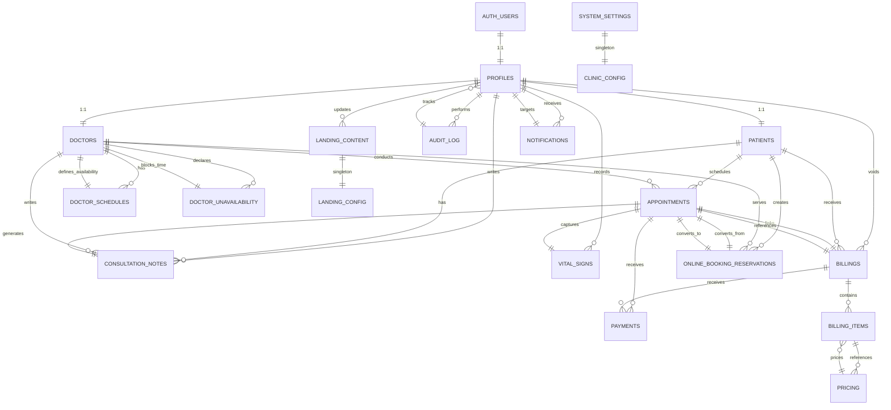
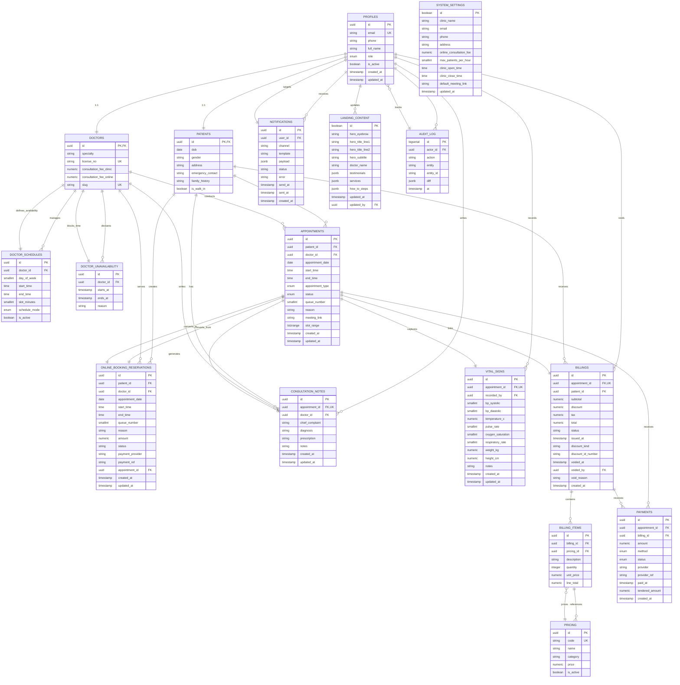

# CHIARA Clinic Management System - Entity Relationship Diagram (ERD)

## Quick Copy for Mermaid.Live

Paste the diagram code below directly into [https://mermaid.live](https://mermaid.live)

---

## Mermaid ERD Code



---

## Alternative: Detailed Mermaid ERD with Attributes

For a more detailed view with entity attributes, use this version:



---

## Entity Relationship Legend

### Relationship Symbols

| Symbol | Meaning |
|--------|---------|
| `\|\|--\|\|` | One-to-One (1:1) |
| `\|\|--o{` | One-to-Many (1:N) |
| `o{--o{` | Many-to-Many (M:N) |

### Key Indicators

| Symbol | Meaning |
|--------|---------|
| `PK` | Primary Key |
| `FK` | Foreign Key |
| `UK` | Unique Key |

---

## Key Relationships Summary

### 1. **Authentication & Profiles**
- **PROFILES** (extends auth.users)
  - 1:1 with PATIENTS (if role='patient')
  - 1:1 with DOCTORS (if role='doctor')

### 2. **Appointment Workflow**
- **PATIENTS** → (1:N) → **APPOINTMENTS** ← (N:1) ← **DOCTORS**
- **APPOINTMENTS** → (1:1) → **CONSULTATION_NOTES**
- **APPOINTMENTS** → (1:1) → **VITAL_SIGNS**
- **APPOINTMENTS** → (1:1) → **BILLINGS**

### 3. **Doctor Availability**
- **DOCTORS** → (1:N) → **DOCTOR_SCHEDULES** (recurring template)
- **DOCTORS** → (1:N) → **DOCTOR_UNAVAILABILITY** (one-off blocks)

### 4. **Online Booking Pipeline**
- **PATIENTS** → (1:N) → **ONLINE_BOOKING_RESERVATIONS** ← (N:1) ← **DOCTORS**
- **ONLINE_BOOKING_RESERVATIONS** → (1:1) → **APPOINTMENTS** (upon payment conversion)

### 5. **Billing & Payments**
- **PATIENTS** → (1:N) → **BILLINGS**
- **BILLINGS** → (1:N) → **BILLING_ITEMS** ← (N:1) ← **PRICING**
- **BILLINGS** → (1:N) → **PAYMENTS**
- **APPOINTMENTS** → (1:N) → **PAYMENTS**

### 6. **Medical Records**
- **CONSULTATION_NOTES** ← (N:1) ← **DOCTORS** (writer)
- **VITAL_SIGNS** ← (N:1) ← **PROFILES** (recorded_by staff member)

### 7. **System Configuration**
- **SYSTEM_SETTINGS** (singleton: id=true)
- **LANDING_CONTENT** (singleton: id=true)
- **AUDIT_LOG** (tracks all changes)

### 8. **Notifications**
- **PROFILES** → (1:N) → **NOTIFICATIONS** (user_id)

---

## How to Use in Mermaid.Live

1. Go to [https://mermaid.live](https://mermaid.live)
2. Click **Code** or **Edit** button
3. Clear the default diagram
4. Paste one of the Mermaid codes above (simple or detailed)
5. Click **Render** or press `Ctrl+Enter`
6. Use the **Export** button to save as PNG/SVG

### Tips
- **Simple version:** Best for presentations, high-level understanding
- **Detailed version:** Best for development, shows all attributes and keys
- **Zoom:** Use your browser's zoom to adjust size
- **Export:** PNG for slides, SVG for vector editing in design tools

---

## Additional Schema Details

### Critical Constraints

```sql
-- Patient no-overlap (GiST exclusion)
CONSTRAINT patient_no_overlap EXCLUDE USING gist (
  patient_id WITH =,
  slot_range WITH &&
) WHERE (status NOT IN ('Cancelled','NoShow'));

-- Doctor clinic/online conflict (GiST exclusion)
CONSTRAINT doctor_shared_slot_type_conflict EXCLUDE USING gist (
  doctor_id WITH =,
  appointment_type WITH <>,
  slot_range WITH &&
) WHERE (status NOT IN ('Cancelled','NoShow'));

-- Doctor unavailability overlap (GiST exclusion)
CONSTRAINT doctor_unavailability_overlap EXCLUDE USING gist (
  doctor_id WITH =,
  tstzrange(starts_at, ends_at, '[)') WITH &&
);
```

### Enums

```sql
user_role: 'super_admin', 'admin', 'secretary', 'doctor', 'patient'
appt_type: 'Clinic', 'Online'
schedule_mode: 'Clinic', 'Online', 'Both'
appt_status: 'PendingPayment', 'Confirmed', 'CheckedIn', 'InProgress', 'Completed', 'Cancelled', 'NoShow'
payment_status: 'Pending', 'Paid', 'Failed', 'Refunded'
payment_method: 'Cash', 'GCash', 'QR', 'Card', 'BankTransfer'
```

---

**Created:** May 10, 2026  
**For:** CHIARA Clinic Management System  
**Format:** Mermaid.js ERD  
**Compatibility:** Mermaid Live, Markdown Renderers, Confluence, GitHub

